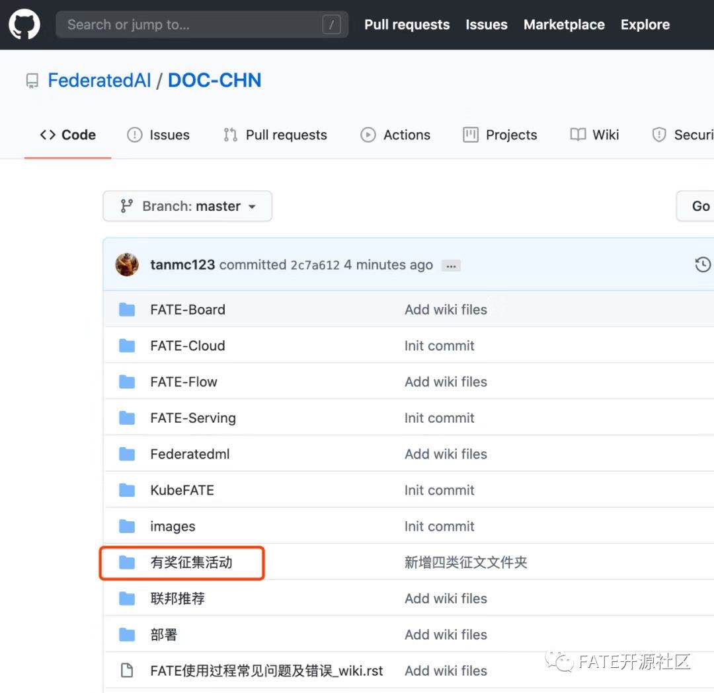
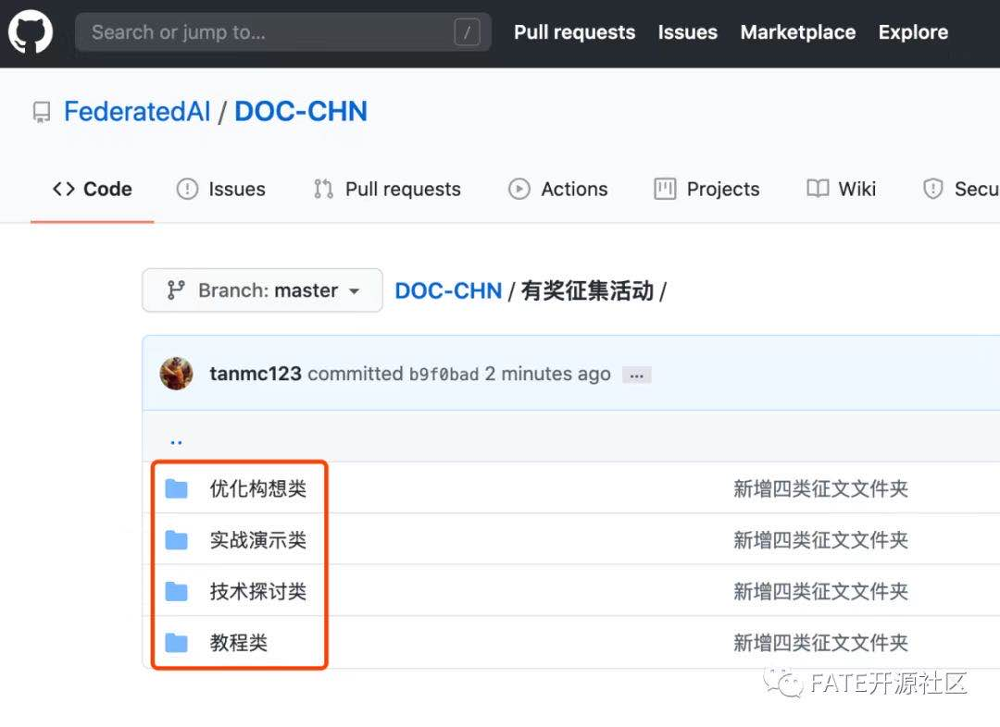

**一直以来，各位社区的朋友都在持续地为FATE贡献有用建议和宝贵经验，如FATE详细部署教程、实战技巧等。为了让这些宝贵的建议和经验被更多朋友看见，发挥更大的价值， FATE官方特别举办了中文文档有奖征集活动，并开设DOC专区以收纳该部分文档。**

 

大家将自己的想法、建议以及经验写下来，在GitHub DOC专区提pr，即可参与活动。除了丰厚的京东E卡、FATE周边作为活动奖励，对于review通过的朋友，我们还会在FATE各大官方平台进行个人专属宣传以及其作品展示。

 

一切都已经准备好，只差爱分享、爱写作的你了！

 

活动详情，请看以下介绍↓↓↓

 

活动流程：

1）撰写中文文档；

2）在FederatedAI GitHub上的DOC有奖征集对应文档专区，上传文档并且提交pr即可完成。

 

 

奖励规则：

l 用户提交文档后，FATE专家团将进行内容评估，根据文档内容价值给予一级、二级、三级社区作家评定，对应激励如下：

 

| 序号 | 等级 | 奖励       |
| ---- | ---- | ---------- |
| 1    | 一级 | 800元 JD卡 |
| 2    | 二级 | 500元 JD卡 |
| 3    | 三级 | 300元 JD卡 |

l 社区作家及个人文章将在FATE官网、GitHub等官方平台做进一步披露；

l 社区作家将优先参与月度社区建设者、年度社区建设者等活动的评选；

 

活动征集文档分类：

1）教程类，主要为图文结合教授单项或多项实操技巧，如：FATE部署教程、算法调试教程、FATEBoard使用教程等；能够指导用户的具体如何使用的详细步骤，详细的文字说明+截图；

扫码可进一步查看参考文档

 

 

2）技术探讨类，主要是针对FATE的单项或多项技术进行剖析，如分析理解算法原理，或者剖析工程应用中的架构设计等，附带原理说明图或者架构设计图，并加入和同类其他产品或者学术论文中的方案比较为佳；

 

3）实战演示类，主要是使用FATE进行实战开发的经验分享，包括开发新算法中的心得体会，使用FATE建模时遇到的困难和解决方案等。涵盖详细的步骤展示，结果说明图示等，帮助后续用户有效避开可能出现的坑；

【实战类文档框架参考】

实战项目/经验的整体介绍，如什么背景下、出于什么目的开始了该实战项目，该项目分享出来对于其他人员的意义；

描述实战项目的整体操作过程，相应的步骤描述图文结合最佳；

附上实战项目中的一些操作注意事项/重点/难点及对应的解决手段，图文结合最佳；

总结项目经验，附上资料/项目参考链接；

 

4）优化构想类，主要是对FATE的功能、模块进行优化/增删改的合理想法，描述具体新颖的想法、创新点，描述想法所提供的详细功能，以及该想法可能使用或应用的场景，想法的可行性说明等，并附带较为详细的功能或架构设计图，如有demo或验证举例更佳。

 

如已提交PR或有对以上活动内容任何疑问，欢迎随时联系FATE小助手 （搜索IDFATEZS001或扫描下方二维码，即可添加小助手），小助手将在第一时间为你答疑解惑。

感谢各位朋友的支持，FATE社区期待更多的朋友加入联邦AI生态。