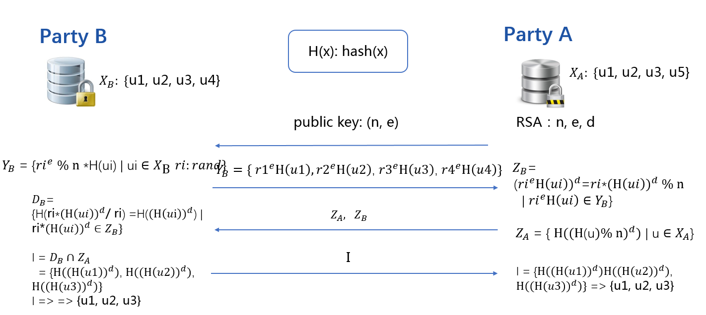
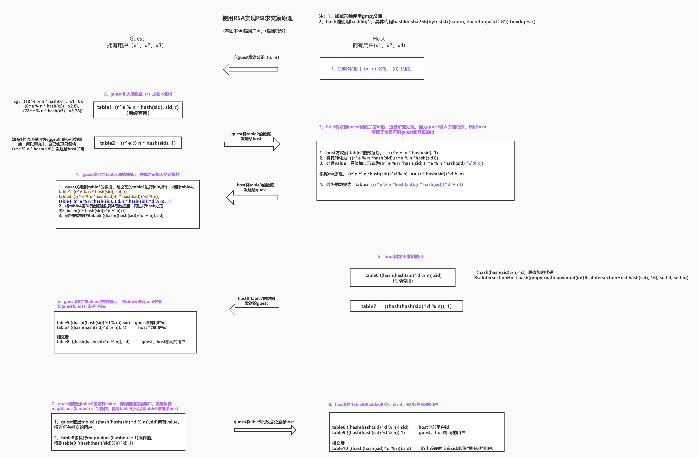

# PSI交集过程--核心流程
fate为我们提供了intersect组件进行psi求交，该组件提供了raw、rsa两种求交方式。下面来介绍一下rsa求交和raw求交的具体流程，代码位置federatedml/statistic/intersect。
 
## 一、rsa 求交过程

####1.1 流程图





####1.2 代码分析

##### Guest 
代码位置：federatedml/statistic/intersect/intersect_guest.py
```
def run(self, data_instances):
        LOGGER.info("Start rsa intersection")

        # 接收host传过来的公钥 e、n
        public_keys = self.transfer_variable.rsa_pubkey.get(-1)
        LOGGER.info("Get RSA public_key:{} from Host".format(public_keys))
        self.e = [int(public_key["e"]) for public_key in public_keys]
        self.n = [int(public_key["n"]) for public_key in public_keys]

        cache_version_match_info = self.get_cache_version_match_info()

        # 哈希sid，引入随机数r并加密r
        # table (r^e % n * hash(sid), sid, r)
        guest_id_process_list = [ data_instances.map(lambda k, v: self.guest_id_process(k, random_bit=self.random_bit, rsa_e=self.e[i], rsa_n=self.n[i])) for i in range(len(self.e)) ]

        # 将r^e % n *hash(sid)发送给host
        # table(r^e % n *hash(sid), 1)
        #因为eggroll 是kv型，为了适配将value设置为1，实际上只会用到key
        for i, guest_id in enumerate(guest_id_process_list):
            mask_guest_id = guest_id.mapValues(lambda v: 1)
            self.transfer_variable.intersect_guest_ids.remote(mask_guest_id,role=consts.HOST,idx=i)
            LOGGER.info("Remote guest_id to Host {}".format(i))

        # 接收host方的哈希后的id  ==》((Hash(Hash(sid)%n)^d),1)
        host_ids_process_list = self.get_host_id_process(cache_version_match_info)
        LOGGER.info("Get host_ids_process")

        # Recv process guest ids
        # table(r^e % n *hash(sid), guest_id_process)
        recv_guest_ids_process = self.transfer_variable.intersect_guest_ids_process.get(idx=-1)
        LOGGER.info("Get guest_ids_process from Host")

        # 将table (r^e % n * hash(sid), sid, r) 和 table(r^e % n *hash(sid), guest_id_process) 进行join
        #                =====
        # table(r^e % n *hash(sid), sid, hash(guest_ids_process/r))
        guest_ids_process_final = [v.join(recv_guest_ids_process[i], lambda g, r: (g[0], RsaIntersectionGuest.hash(gmpy2.divm(int(r), int(g[1]), self.n[i]))))
                                   for i, v in enumerate(guest_id_process_list)]


        # table(hash(guest_ids_process/r), sid))  ====> table ((Hash(Hash(sid)%n)^d),sid)     
        sid_guest_ids_process_final = [
            g.map(lambda k, v: (v[1], v[0]))
            for i, g in enumerate(guest_ids_process_final)]

        # Guest 和 host sid 进行求交，得到加密的交集id
        # Guest所有用户id   ((Hash(Hash(sid)%n)^d),sid)     
        # Host所有用户id    ((Hash(Hash(sid)%n)^d),1)
        # 最终交集          intersect table((Hash(Hash(sid)%n)^d), sid)
        encrypt_intersect_ids = [v.join(host_ids_process_list[i], lambda sid, h: sid) for i, v in
                                 enumerate(sid_guest_ids_process_final)]

        #如果是多方的话，还要求一次最终的交集
        if len(self.host_party_id_list) > 1:
            raw_intersect_ids = [e.map(lambda k, v: (v, 1)) for e in encrypt_intersect_ids]
            intersect_ids = self.get_common_intersection(raw_intersect_ids)

            # send intersect id
            if self.sync_intersect_ids:
                for i, host_party_id in enumerate(self.host_party_id_list):
                    remote_intersect_id = self.map_raw_id_to_encrypt_id(intersect_ids, encrypt_intersect_ids[i])
                    self.transfer_variable.intersect_ids.remote(remote_intersect_id,
                                                                role=consts.HOST,
                                                                idx=i)
                    LOGGER.info("Remote intersect ids to Host {}!".format(host_party_id))
            else:
                LOGGER.info("Not send intersect ids to Host!")
        else:
            intersect_ids = encrypt_intersect_ids[0]
            if self.sync_intersect_ids:

                #将最终的交集发送给host    table((Hash(Hash(sid)%n)^d), 1)
                remote_intersect_id = intersect_ids.mapValues(lambda v: 1)
                self.transfer_variable.intersect_ids.remote(remote_intersect_id,
                                                            role=consts.HOST,
                                                            idx=0)

            intersect_ids = intersect_ids.map(lambda k, v: (v, 1))

        LOGGER.info("Finish intersect_ids computing")

        if not self.only_output_key:
            intersect_ids = self._get_value_from_data(intersect_ids, data_instances)

        return intersect_ids
```

1.	guest 接收公钥。
2.	guest 对本方的用户id进行hash,引入随机数r,并将r进行加密,得到table (r^e % n * hash(sid), sid, r)，然后value变成1后table ((r^e % n * hash(sid)),1)发送给host。
3.  guest接收host方哈希后的host全部用户sid， table ((Hash(Hash(sid)%n)^d),1)。
4.  guest接收host方处理后的guest全部用户sid, table(r^e % n *hash(sid), guest_id_process)。
5.  将table (r^e % n *hash(sid), guest_id_process) 和 table (r^e % n * hash(sid), sid, r) 进行join 等操作后，得到最终table ((Hash(Hash(sid)%n)^d),sid)。
6.  将Guest全部sid  **((Hash(Hash(sid)%n)^d),sid)**和 host全部sid **((Hash(Hash(sid)%n)^d),1)**进行求交，得到加密的交集id intersect table((Hash(Hash(sid)%n)^d), sid)。
7.  guest取出value,即交集后的sid,并将value处理成1后  ((Hash(Hash(sid)%n)^d), 1)发送给host。


### Host
代码位置：federatedml/statistic/intersect/intersect_host.py
```
 def run(self, data_instances):
        LOGGER.info("Start rsa intersection")

        #host 生成公私钥e、d、n
        self.e, self.d, self.n = self.get_rsa_key()
        LOGGER.info("Get rsa key!")
        public_key = {"e": self.e, "n": self.n}

        #将公钥e、n发送给guest
        self.transfer_variable.rsa_pubkey.remote(public_key,
                                                 role=consts.GUEST,
                                                 idx=0)
        LOGGER.info("Remote public key to Guest.")

        # host对本侧的用户id进行hash
        # RsaIntersectionHost.hash(gmpy_math.powmod(int(RsaIntersectionHost.hash(sid), 16), self.d, self.n)), sid
        # host_ids_process_pair = ((Hash(Hash(sid)%n)^d),sid)
        host_ids_process_pair = self.host_ids_process(data_instances)

        if self.intersect_cache_param.use_cache and not self.is_version_match or not self.intersect_cache_param.use_cache:
            # send ((Hash(Hash(sid)%n)^d), 1) to guest
            host_ids_process = host_ids_process_pair.mapValues(lambda v: 1)
            self.transfer_variable.intersect_host_ids_process.remote(host_ids_process,
                                                                     role=consts.GUEST,
                                                                     idx=0)
            LOGGER.info("Remote host_ids_process to Guest.")

        # 接收加密的 guest ids
        guest_ids = self.transfer_variable.intersect_guest_ids.get(idx=0)
        LOGGER.info("Get guest_ids from guest")


        
        # Process guest ids and return to guest
        # guest_ids_process (r^e % n *hash(sid),(r^e % n *hash(sid))^d % n) 
        #                        =====
        # guest_ids_process (r^e % n *hash(sid),(r * hash(sid))^d % n)      
        # send guest_ids_process to guest
        guest_ids_process = guest_ids.map(lambda k, v: (k, gmpy_math.powmod(int(k), self.d, self.n)))
        self.transfer_variable.intersect_guest_ids_process.remote(guest_ids_process,
                                                                  role=consts.GUEST,
                                                                  idx=0)
        LOGGER.info("Remote guest_ids_process to Guest.")

        # 从guest 接收 intersect ids
        intersect_ids = None
        if self.sync_intersect_ids:
            encrypt_intersect_ids = self.transfer_variable.intersect_ids.get(idx=0)
            intersect_ids_pair = encrypt_intersect_ids.join(host_ids_process_pair, lambda e, h: h)
            intersect_ids = intersect_ids_pair.map(lambda k, v: (v, "id"))
            LOGGER.info("Get intersect ids from Guest")

            if not self.only_output_key:
                intersect_ids = self._get_value_from_data(intersect_ids, data_instances)

        return intersect_ids
```
 1. 生成公私钥e、d、n，将公钥e、n发送给guest。
 
 2. host对本侧的用户id进行hash，得到table((Hash(Hash(sid)%n)^d),sid),将((Hash(Hash(sid)%n)^d),1)发送给guest
 
 3. host 接收加密的 guest ids，并对r解密, 将(r^e % n *hash(sid),(r * hash(sid))^d % n) 发送给guest
 
 4. host 接收交集后的table((Hash(Hash(sid)%n)^d),1),与之前的host侧全部的id进行join操作((Hash(Hash(sid)%n)^d),sid)，取出交集的sid.
 
 
 
 
## 二、raw求交过程
raw 求交过程相对rsa比较简单,在这里简单分析一下求交过程

### 大致流程 
guest方将本侧的用户id发送给每个host,host收到guest侧的用户id后，与本侧id进行join求交，然后将求交后的结果发送给guest,guest收到每个host方的交集结果后，将所有结果进行join求交，得到最终的多方的交集结果，最后guest将多方的交集结果发送给每个host.


### 代码解析 
##### Guest 
代码位置：federatedml/statistic/intersect/intersect.py
```
def intersect_send_id(self, data_instances):
        sid_encode_pair = None
        #是否加密，以及使用哪种方法加密，目前支持md5, sha1, sha224, sha256, sha384, sha512, 默认是不加密 None
        if self.with_encode and self.encode_params.encode_method != "none":
            if Encode.is_support(self.encode_params.encode_method):
                encode_operator = Encode(self.encode_params.encode_method, self.encode_params.base64)
                sid_encode_pair = data_instances.map(
                    lambda k, v: (encode_operator.compute(k, postfit_salt=self.encode_params.salt), k))
                data_sid = sid_encode_pair.mapValues(lambda v: 1)
            else:
                raise ValueError("Unknown encode_method, please check the configure of encode_param")
        else:
            data_sid = data_instances.mapValues(lambda v: 1)

        LOGGER.info("Send id role is {}".format(self.role))

        if self.role == consts.GUEST:
            #默认会走此逻辑
            send_ids_federation = self.transfer_variable.send_ids_guest
            recv_role = consts.HOST
        elif self.role == consts.HOST:
            send_ids_federation = self.transfer_variable.send_ids_host
            recv_role = consts.GUEST
        else:
            raise ValueError("Unknown intersect role, please check the code")

        send_ids_federation.remote(data_sid,
                                   role=recv_role,
                                   idx=-1)

        LOGGER.info("Remote data_sid to role-join")
        intersect_ids = None
        if self.sync_intersect_ids:
            if self.role == consts.HOST:
                intersect_ids_federation = self.transfer_variable.intersect_ids_guest
            elif self.role == consts.GUEST:
                intersect_ids_federation = self.transfer_variable.intersect_ids_host
            else:
                raise ValueError("Unknown intersect role, please check the code")

            #得到交集的id
            recv_intersect_ids_list = intersect_ids_federation.get(idx=-1)
            LOGGER.info("Get intersect ids from role-join!")

            ids_list_size = len(recv_intersect_ids_list)
            LOGGER.info("recv_intersect_ids_list's size is {}".format(ids_list_size))

            #如果是多方的话，guest会汇总所有host传回来的id,做一次最终的求交
            recv_intersect_ids = self.get_common_intersection(recv_intersect_ids_list)

            #如果是多方，将多方最终相交的id发送给各个host
            if self.role == consts.GUEST and len(self.host_party_id_list) > 1:
                LOGGER.info(
                    "raw intersect send role is guest, and has {} hosts, remote the final intersect_ids to hosts".format(
                        len(self.host_party_id_list)))
                self.transfer_variable.sync_intersect_ids_multi_hosts.remote(recv_intersect_ids,
                                                                             role=consts.HOST,
                                                                             idx=-1)

            #如果做了加密处理，通过join取出原始的sid
            if sid_encode_pair and recv_intersect_ids is not None:
                encode_intersect_ids_map = recv_intersect_ids.join(sid_encode_pair, lambda r, s: s)
                intersect_ids = encode_intersect_ids_map.map(lambda k, v: (v, 'intersect_id'))
            else:
                intersect_ids = recv_intersect_ids
        else:
            LOGGER.info("Not Get intersect ids from role-join!")

        if not self.only_output_key:
            通过sid,取出特征，返回给fate_flow
            intersect_ids = self._get_value_from_data(intersect_ids, data_instances)

        return intersect_ids

```

##### Host
代码位置：federatedml/statistic/intersect/intersect.py
```
def intersect_join_id(self, data_instances):
        LOGGER.info("Join id role is {}".format(self.role))

        sid_encode_pair = None
        #是否加密，以及使用哪种方法加密，目前支持md5, sha1, sha224, sha256, sha384, sha512, 默认是不加密 None
        if self.with_encode and self.encode_params.encode_method != "none":
            if Encode.is_support(self.encode_params.encode_method):
                encode_operator = Encode(self.encode_params.encode_method, self.encode_params.base64)
                sid_encode_pair = data_instances.map(
                    lambda k, v: (encode_operator.compute(k, postfit_salt=self.encode_params.salt), k))
                data_sid = sid_encode_pair.mapValues(lambda v: 1)
            else:
                raise ValueError("Unknown encode_method, please check the configure of encode_param")
        else:
            data_sid = data_instances.mapValues(lambda v: 1)

        
        if self.role == consts.HOST:
            send_ids_federation = self.transfer_variable.send_ids_guest
        elif self.role == consts.GUEST:
            send_ids_federation = self.transfer_variable.send_ids_host
        else:
            raise ValueError("Unknown intersect role, please check the code")

        recv_ids_list = send_ids_federation.get(idx=-1)

        ids_list_size = len(recv_ids_list)
        LOGGER.info("Get ids_list from role-send, ids_list size is {}".format(len(recv_ids_list)))


        #进行join,得到本侧host与guest的交集
        if ids_list_size == 1:
            encode_intersect_ids = recv_ids_list[0].join(data_sid, lambda i, d: "intersect_id")
        elif ids_list_size > 1:
            encode_intersect_ids_list = []
            for ids in recv_ids_list:
                encode_intersect_ids_list.append(ids.join(data_sid, lambda i, d: "intersect_id"))
            encode_intersect_ids = self.get_common_intersection(encode_intersect_ids_list)
        else:
            encode_intersect_ids = None
        LOGGER.info("Finish intersect_ids computing")

        if self.sync_intersect_ids:
            if self.role == consts.GUEST:
                intersect_ids_federation = self.transfer_variable.intersect_ids_guest
                send_role = consts.HOST
            elif self.role == consts.HOST:
                intersect_ids_federation = self.transfer_variable.intersect_ids_host
                send_role = consts.GUEST
            else:
                raise ValueError("Unknown intersect role, please check the code")

            #将交集的id发送给host
            intersect_ids_federation.remote(encode_intersect_ids,
                                            role=send_role,
                                            idx=-1)
            LOGGER.info("Remote intersect ids to role-send")

            #如果是多方进行psi求交，要从guest得到最终的多方的交集
            if self.role == consts.HOST and len(self.host_party_id_list) > 1:
                LOGGER.info(
                    "raw intersect join role is host, and has {} hosts, get the final intersect_ids from guest".format(
                        len(self.host_party_id_list)))
                encode_intersect_ids = self.transfer_variable.sync_intersect_ids_multi_hosts.get(idx=0)

        #如果做了加密处理，通过join取出原始的sid
        if sid_encode_pair:
            encode_intersect_ids_map = encode_intersect_ids.join(sid_encode_pair, lambda r, s: s)
            intersect_ids = encode_intersect_ids_map.map(lambda k, v: (v, 'intersect_id'))
        else:
            intersect_ids = encode_intersect_ids

        if not self.only_output_key:
            intersect_ids = self._get_value_from_data(intersect_ids, data_instances)

        if self.task_id is not None:
            namespace = "#".join([str(self.guest_party_id), str(self.host_party_id), "mountain"])
            for k, v in enumerate(recv_ids_list):
                table_name = '_'.join([self.task_id, str(k)])
                v.save_as(table_name, namespace)
                LOGGER.info("save guest_{}'s id in name:{}, namespace:{}".format(k, table_name, namespace))

        return intersect_ids

```
