# fate算法模块信息

------
主要文档介绍官方给的一部分算法流程内部情况

> * 1、Dataio	
> * 2、Intersection	
> * 3、Hetero_Lr	
> * 4、evaluation_0	
> * 5、Hetero_Secureboost	

## 1.Dataio

#### 1.1.运行前数据
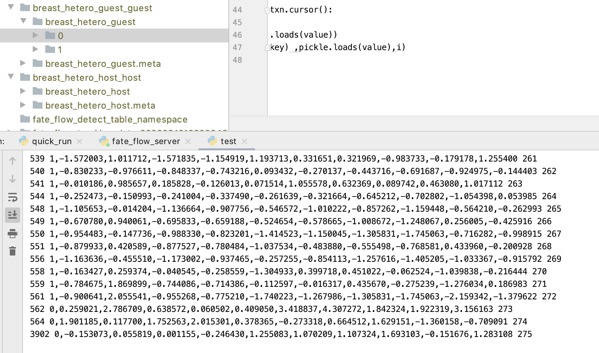
图 1 upload之后的数据图

#### 1.2.运行之后的数据
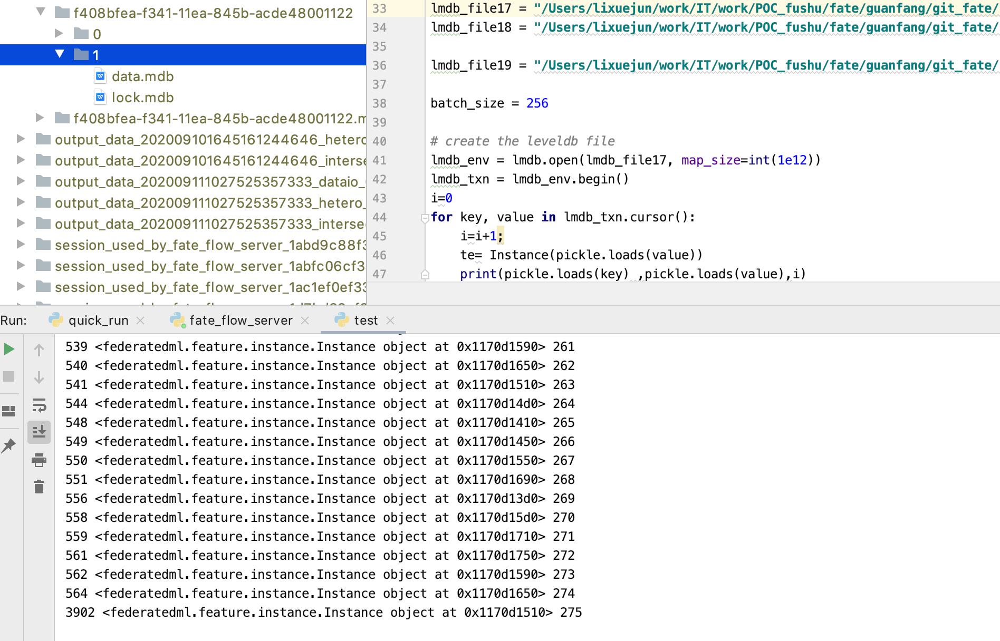
图 2 dataio运行之后数据格式
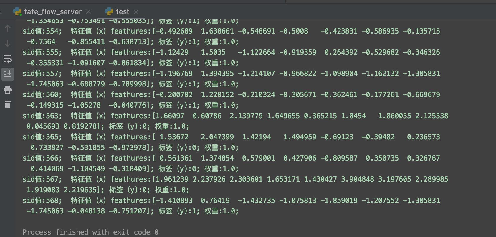
图 3 具体内容

#### 1.3.分析

数据upload之后数据如图1，，全是明文状态，由于之前配置文件设置的分区是两个分区，所以看出有两个文件夹。分别为0，1.
经过dataio之后数据的结果如图2，经了解以及代码查看，instance包括weight权重，features特征值，label标签。

## 2.Intersection
#### 2.1.数据上传前host数据
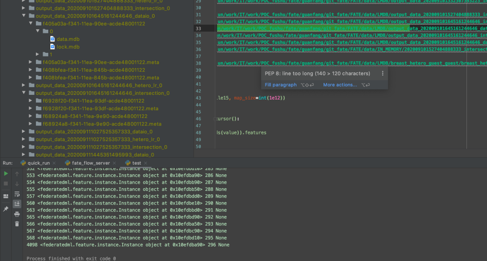   
图 4 数据经过intersection之前图
#### 2.2.数据上传前guest数据
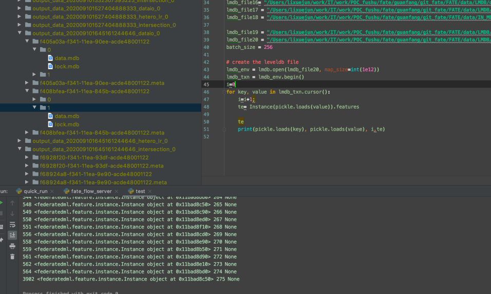
图 5 数据经过intersection之前图

#### 2.3.数据经过intsection后guest数据
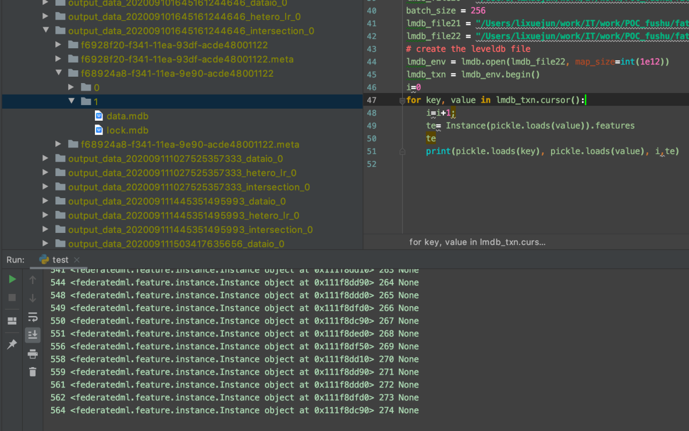
图 6 数据经历intsection之后guest数据
#### 2.4.数据经过intsection后host数据
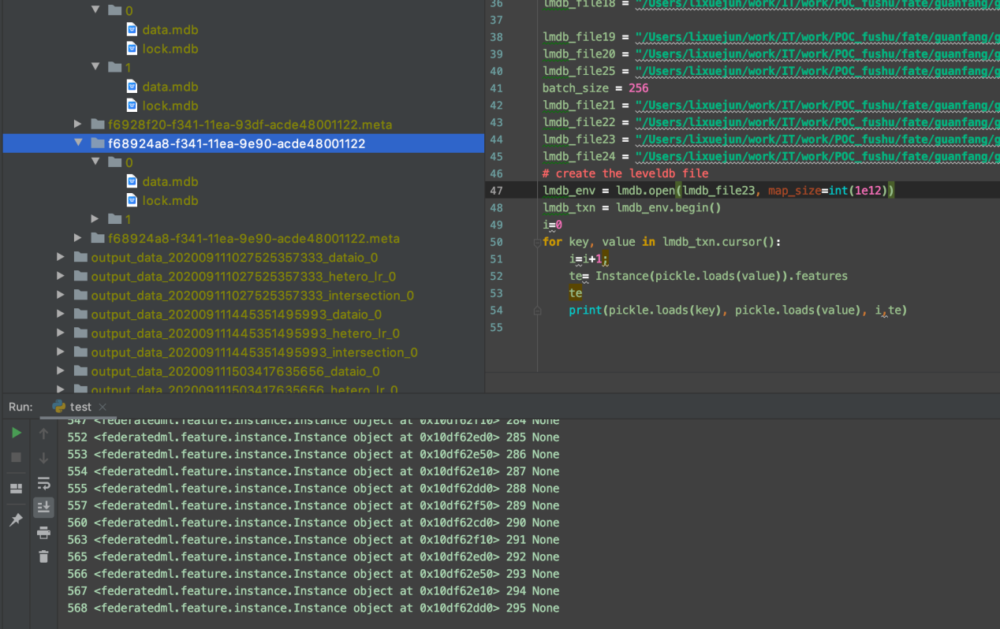
图 7 数据经历intsection之后host数据

图 8 Instance属性值
#### 2.5.公私钥
1.生成方：host

2.发送方：guest

3.操作字段	：数据id，封装成sid字段

#### 4.rsakey：

a)"e": 65537, 

b)"d": 655184017050822848806336059182629522061469354055062114882801034140858854135131334260379640442441422136340553466085207599031280746344619290192191912492399773587356856541042150857485520985736282701768229468330258669270948393326641481085359977737549881342290524971139256856446852646159029429340528611004630273,

c)"n": 30848383197804052889176814163674207717164697053778495278249324814708580478977008539946673355610089484346133692510046532702160932118340884051601920997833113359556476966325487973995849659964706400975905241258859050578432546951333248110905569276122022408651879004683266312259409896753270125373426386913968800323
#### 5.publickey：

a)'e': 65537, 

b)'n': 30848383197804052889176814163674207717164697053778495278249324814708580478977008539946673355610089484346133692510046532702160932118340884051601920997833113359556476966325487973995849659964706400975905241258859050578432546951333248110905569276122022408651879004683266312259409896753270125373426386913968800323

Ps：rsa密钥包括，e,d,n,三块,e,n,作为公钥发放给guest，d,作为私钥保留

#### 2.6.任务解析
Intersection主要进行的是数据的交互，也可以称为数据对齐，比对，guest和host两端的id字段或者是数据标识字段，在fate中默认是数据的第一列，然后这个会被在Dtable中保存成sid字段，进行Intersection过程，会进行加密，加密过程分为：
intersect_host.py 171

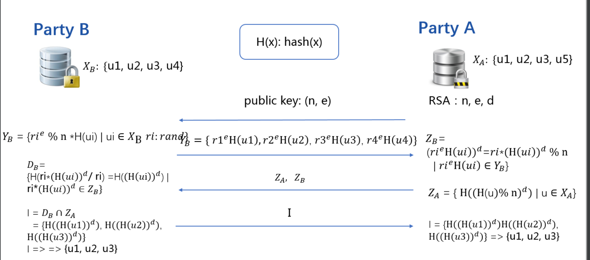

1、host生成密钥，e,d,n，生成使用法则,用户名，库表名加时间戳，以及随机数

2、然后把e,n,作为公钥，发送给guest，

3、guest收到公钥，对sid字段进行hash加密，r^e % n * hash(sid) 		intersect_guest.py 135   

4、然后再使用公钥进行加密，

5、然后封装成Dtable数据类，这个类包含，数据库名，表名，

6、把这个数据类发送给host，

7、host取得这个类进行解析与自身的id比对，
这个过程由于e,n,  sid使用hash进行过加密，hash加密属于不可逆的状态

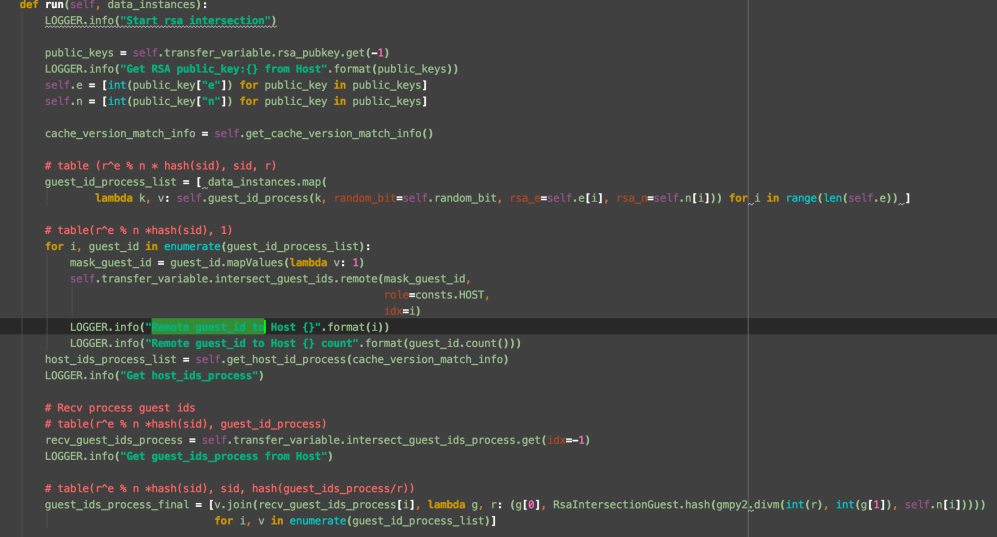

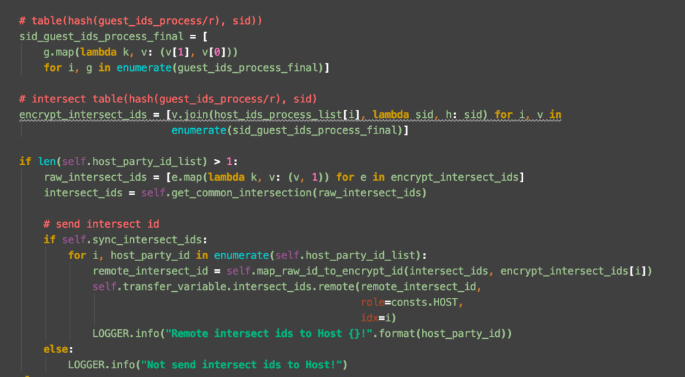

图 9 insection代码过程图

#### 2.7.任务分析

由下图可见，经过intersection，原本host 4098和guest 3092这条数据被舍弃了。两边仅保存了共有的id字段，保存的类型是Instance。保存数据字段还是自己原有的字段，无host端的字段。

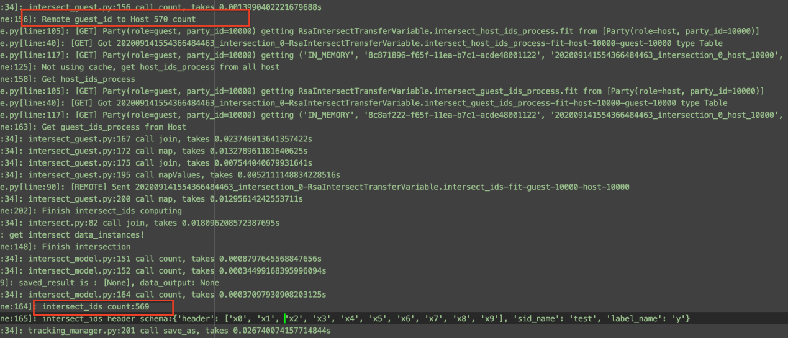

图 10 intersection 之后数据转换结果图

## 3.Hetero_Lr

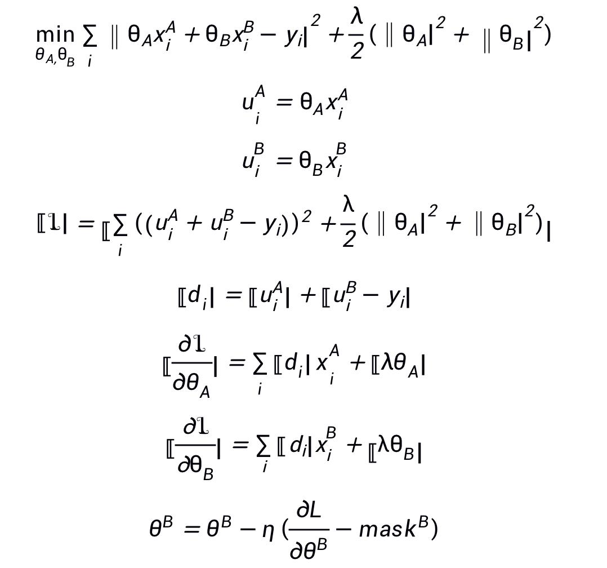

图 11 公式图

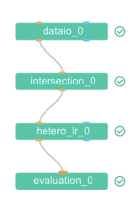

图 12 训练过程图

#### 3.1.运行前数据

图 13 intersection之后的数据

此图打印的数据为Intance类对应属性值，主要把原始数据转换成类的属性进行封装保存，在后续使用。

#### 3.2.运行后数据

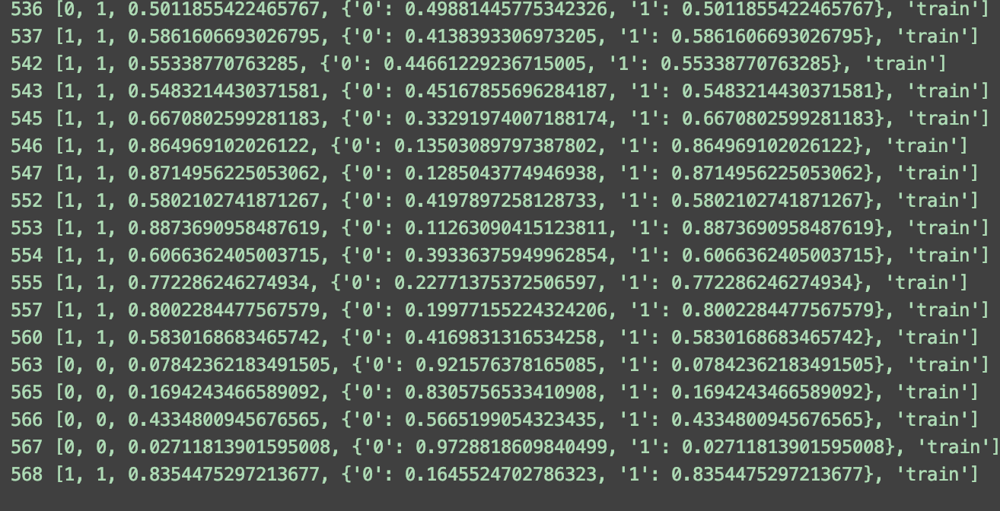

图 14  Hetero_Lr算法训练之后的数据

#### 3.3.数据传输的公私钥发放

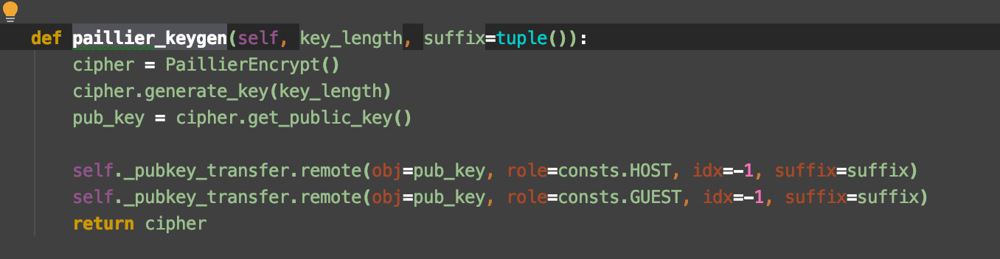

图 15 生成公私钥的方法

密钥生成方：arbiter

生成方式：随机

接受方：host，guest 接收publickey公钥

密钥内容：私钥：<PaillierPrivateKey x5cc8ba68a> 公钥：<PaillierPublicKey 1d0751e82d>

#### 3.4.过程分析

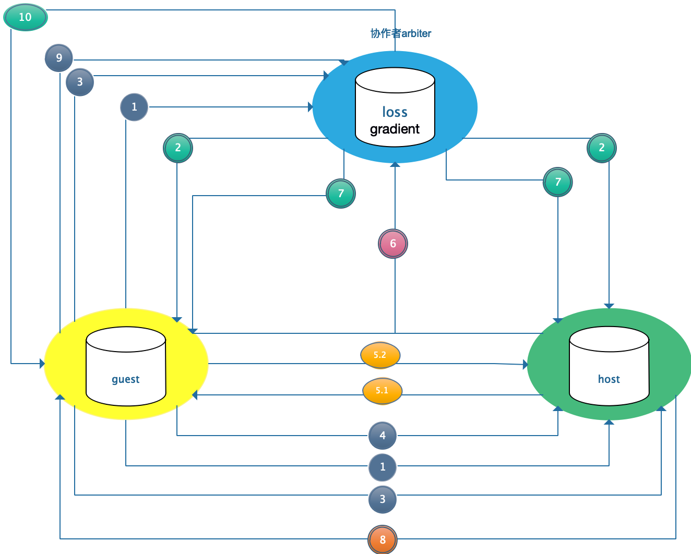

图 16 Heletro_lr训练内容图

#####  1、传递变量 

Sent 202009151522107450356_hetero_lr_0-OneVsRestTransferVariable.aggregate_classes-fit-guest-10000-host-10000

发送方：guest，

接收方：host，atbiter

发送内容：OneVsRest类，信息包括。任务id，角色成分，模型类型，多方同步信息

类：hetero_lr_guest.py 65 one_vs_rest.py

##### 2、收发密钥 

a)生成类：base_linear_model_arbiter.py 72

b)生成方发送方：arbiter，

c)密钥：

密钥私钥：<x5cc8ba68a> 

公钥：<1d0751e82d>

d)接收方：host，guest  

e)使用类：hetero_lr_guest.py82

##### 3、发送任务信息 

Sent 202009151522107450356_hetero_lr_0-HeteroLRTransferVariable.batch_info-fit-guest-10000-host-10000

发送方：guest，

接收方：arbiter，host

内容： 发送的batch_info 
dict_keys(['batch_size', 'batch_num']) 
dict_values([-1, 1])

类： batch_generator.py 35

##### 4、发送数据批次信息

Sent 202009151522107450356_hetero_lr_0-HeteroLRTransferVariable.batch_data_index-fit.0-guest-10000-host-10000

发送方：guest

接收方：host

内容：主要发送是一个Dtable类型的类。里面包含批处理数据的信息

类：batch_generator.py 43

##### 5、交互中间值

1）发送方：host 对应官方图中的Ua

类：hetero_linear_model_gradient.py 238

内容：Sent 2020091710030307679418_hetero_lr_0-HeteroLRTransferVariable.host_forward_dict-fit.0.0-host-10000-guest-10000
对应官方图中的Ua,wx，主要发送是一个Dtable类型的类，包含数	据库的信息，以及公钥信息，通信id，对于wx内容，一下选取Dtable第一个作为展示

加密前：程使用的wx('0', 12.817840132236148)

加密后：加密之后的wx('0', <federatedml.secureprotol.fate_paillier.PaillierEncryptedNumber object at 0x30a9d02e90>)， PaillierEncryptedNumber 是一个同态加密类。密文就不展示类，和下文密文类都是1024长度的值。

接收方：guest

2）发送方：guest  对应官方图中

类：hetero_lr_gradient_and_loss.py 40

Δι(w) = (1/N)*∑(1/2*ywx-1)*1/2yx = (1/N)*∑(0.25 * wx - 0.5 * y) * x

这里假设 y=1 or -1

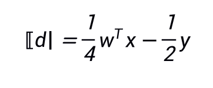

内容：Sent 2020091710030307679418_hetero_lr_0-HeteroLRTransferVariable.fore_gradient-fit.1.0-guest-10000-host-10000
guest发给host的[[d]]fore_gradient：('0', <federatedml.secureprotol.fate_paillier.PaillierEncryptedNumber object at 0x2bad7aff10>)

明文内容：('0', 8.776067545224512),

接收方：host

##### 6、发送梯度值

发送方：guest，host 

类：hetero_linear_model_gradient.py 97

内容：密文783818290007612149087255866468880837735100753468235668659776754918315902674331452019338448456930406779188317554956227977056726599109507252022364145247242257608793498141201244856394675402041390188533674421971627034303834043550733653397877238869147443409296418096029429313100703235789081020351352263301006066035259088661357470677169011330872754445794960588931723625025152751930274700132948949931293141410236777231894393626404145111724103662225162915642015995721718276700213422382998259776863979091442518946576278095626063368493178971416097596982625413368485837019409754120712116383203966503839882599522099674436058922

接收方：arbiter 

类：optimizer.py 205

内容：解密后 未解密时获取的都是多个 PaillierEncryptedNumber类对象

v: [-0.28700291 -0.17384846 -0.30139084 -0.29083381 -0.23139691 -0.35584419
-0.37570473 -0.37239525 -0.21588468 -0.13863895 -0.29492719 -0.07518471
-0.30278458 -0.27783686 -0.08047655 -0.27471229 -0.23964593 -0.28452073
-0.10403616 -0.19259517 -0.30132398 -0.17349659 -0.3154668  -0.29859349
-0.20688871 -0.30608615 -0.32829587 -0.35275677 -0.18407238 -0.21826018 -0.01781036]

##### 7、发送优化后的梯度值δ

发送方：arbiter

类：base_linear_model_arbiter.py 90

内容：delta_grad: [0.54530554 0.33031207 0.5726426  0.55258425 0.43965414 0.67610396
0.71383899 0.70755097 0.4101809  0.26341401 0.56036165 0.14285095
0.57529071 0.52789004 0.15290544 0.52195336 0.45532726 0.54058938
0.1976687  0.36593083 0.57251557 0.32964352 0.59938692 0.56732764
0.39308855 0.58156368 0.62376216 0.67023786 0.34973752 0.41469434 0.03383968]

接收方：guest，host

##### 8、发送计算后的损失函数loss

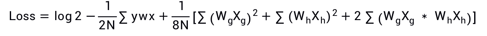

发送方：host

内容：PaillierEncryptedNumber对象list集合，其中一个内容展示

密文：加密后loss17224598447888170507287986007921847247547882478207333213927787915799393249636907791881927189538014853163074067602043063961891181625859135292432569527131964761778711771160744847727385389382082783466206565043767616688094464880884957376507908825289901159542491512685001718086404748697346519609744892898924953338030484103957596728125682557960649639511445432438468709047798241024204977958298807765570827135252854561055667030666033962317695302088956605575773158268927785147337222846627895398695693293271853696977742201688092496218142324656872921761361231943299959487238938486551083432309137827647210146618657894248540001597

明文：host发送到guest loss ：0.010434304538133328

类：hetero_lr_gradient_and_loss.py 143

##### 9、发送计算后的损失函数loss

发送方：guest

内容：PaillierEncryptedNumber对象list集合，其中一个内容展示

密文：加密后的lossIn compute_loss, loss are: 3762186222411139871013001980649019685660966454566932008653380974047018125321949042958811044670048424171675730771299086755046307379396580873997268614602842765884796467694345914467655746127073901230725450209642566693835403755088457170183991419011546532350669078064988954238204250790795879808811643177985112391956709458224453363362603585934922319274009143382046828589847315654827495060581883187753512816033423784100188975926437556759962807458436625254539493682540328576158849124562722690387096154246954254391108021354985597327879468853743924165130532537871893954569758959598728014256182525652345063882661237448600070747

接受方：arbiter

解密之后的loss：10.952710126646089，数量和迭代次数有关

最后一次loss：0.33814001180822517

类： hetero_lr_gradient_and_loss.py 167

##### 10、发送聚合后loss值

发送方：arbiter

类：base_linear_model_arbiter.py 99

内容：[0.7198285309614745]

接收方：guest

## 4.evaluation_0

#### 4.1.输入数据

图 17 evaluation输入数据

#### 4.2.方法

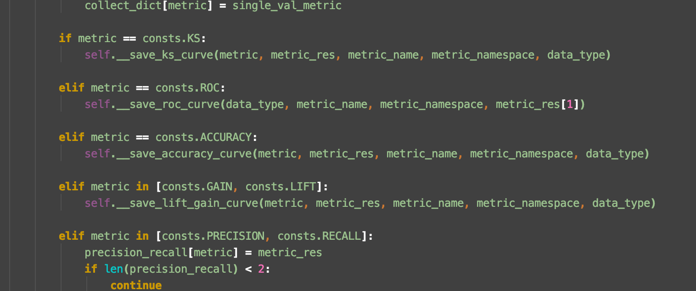

图 18 训练过程图

#### 4.3.输出结果

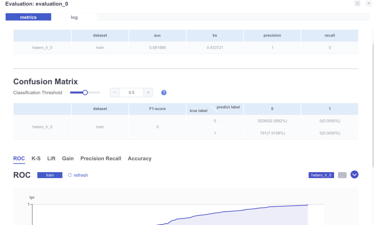

图 19 evaluation结果图

## 5.Hetero_Secureboost

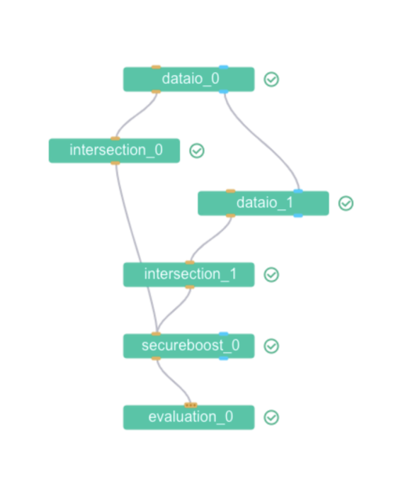

图 20 训练过程图

#### 5.1.输入前数据

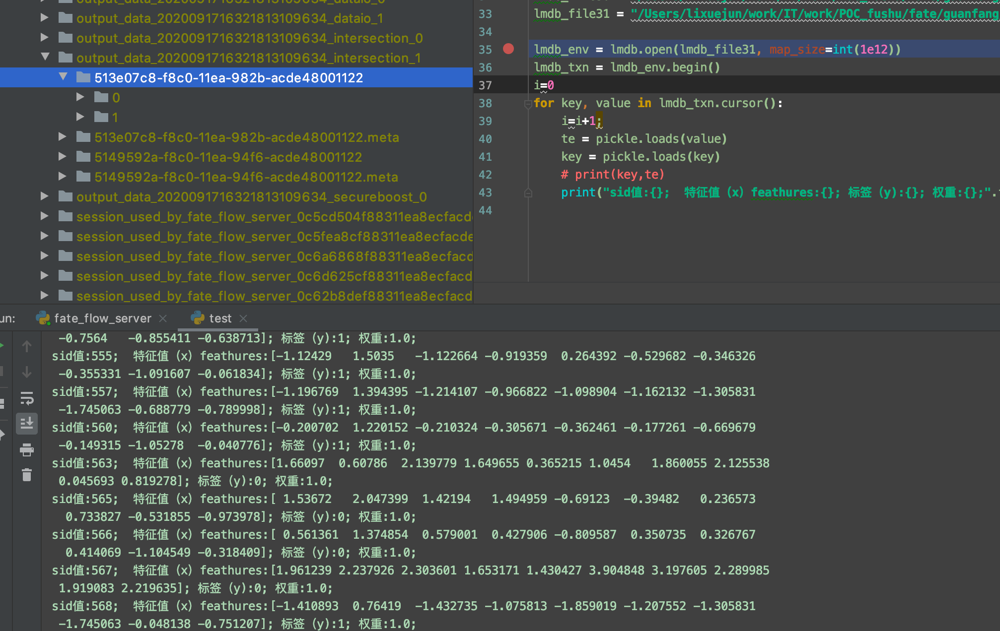

图 21 secureboost模型训练前输入数据

#### 5.2.输出数据 

输出方：guest

图 22 secureboost模型训练后输出数据

#### 5.3.过程解析

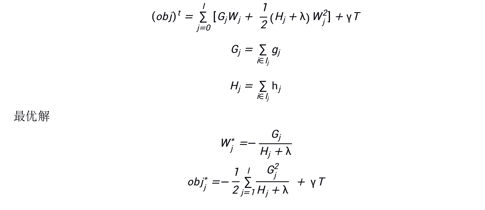

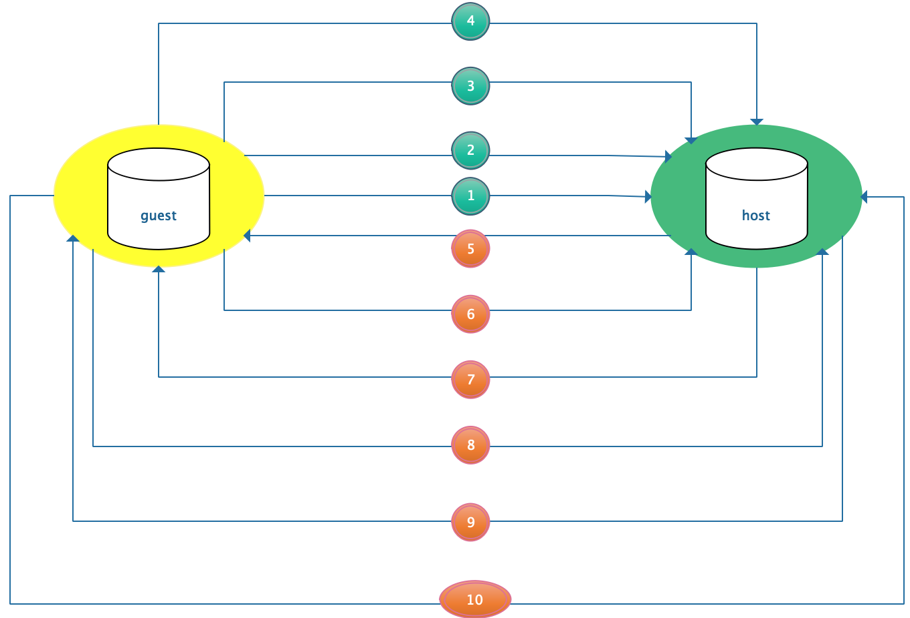

1)获取配置信息同步host方：Sent 2020091716321813109634_secureboost_0-HeteroSecureBoostingTreeTransferVariable.tree_dim-fit-guest-10000-host-10000
 	发送方：guest

接受方：host

内容：树的配置信息 tree dim ===1 

代码位置：hetero_secureboosting_tree_guest.py 284

2)加密训练之后g,h的值：Sent 2020091716321813109634_secureboost_0-HeteroDecisionTreeTransferVariable.encrypted_grad_and_hess-fit.0.0-guest-10000-host-10000

发送方：guest

接受方：host

内容: 主要为了把g，h进行加密，然后使用同态加密的方法在host进行计	算，同态加密支持加法计算，这样即使是加密状态也可以进行进行加密计算，	然后把计算的结果传回给guest，由上面的公式可知双方传输都是系数，另	系数中还有各自的独知的数据，属于不可逆的状态，对方仅可解出最后的和	结果

同态加密密钥:
<PaillierPublicKey 1536d52739>,<PaillierPrivateKey 131d4e0bdb>

未加密时g,h的值,总共569个，和初始的数据量相等：
[('0', (0.5, 0.25)), ... ... ('567', (0.5, 0.25)), ('568', (-0.5, 0.25))]

加密之后的569个PaillierEncryptedNumber 加密对象：
[('0', (<federatedml.secureprotol.fate_paillier.PaillierEncryptedNumber object at 0x6f380b05d0>),••• •••('568', (<federatedml.secureprotol.fate_paillier.PaillierEncryptedNumber object at 0x6f380b05d0>)]

密文信息：7187789633568446384888500380719876843309840887026541667816661351990691961561019295806256792842262425849163191688830897426136195856174639273004518980768113291353329346881267368023004128264227807817380802905622045028540430524819986938860702034022752893723103263885858441148410941929129466345388431034260985486351131198753678275555589136591193318461636492238725943004744301136628484076679674892783902767097834300032676654836641934748933459576185411945490844879198870513303333580551589393928354505446363483889985449185821738632837220125909473656869545351790723900974859366039412016935418872344725783688334144838189820360

长度：1024

Ps：后续加密内容省略，密文长度都是1024

代码位置：hetero_decision_tree_guest.py 161

3)发送树的队列信息：Sent 2020091716321813109634_secureboost_0-HeteroDecisionTreeTransferVariable.tree_node_queue-fit.0.0.0-guest-10000-host-10000

发送方：guest

接受方：host

内容：树队列信息node类型
fid:None,bid:None,weight:1.9374247894103491,sum_grad:-161.0,sum_hess:83.0,left_node:-1,right_node:-1
tree node queue size is 1,内容每次迭代，每次depth数值为n，nodequeue结果是

代码位置：hetero_decision_tree_guest.py 186
4)发送节点配置信息：Sent 2020091716321813109634_secureboost_0-HeteroDecisionTreeTransferVariable.node_positions-fit.0.0.0-guest-10000-host-10000

发送方：guest

接受方：host

内容：发送节点深度信息 
使用的是DTable 类包装的一个list集合
<arch.api.impl.based_1x.table.DTable object at 0xb15783b10>
取其中一个第一条信息的信息：
('0', (1, 12))

代码位置：hetero_decision_tree_guest.py 204

5)发送加密数据初始分割信息：Sent 2020091716321813109634_secureboost_0-HeteroDecisionTreeTransferVariable.encrypted_splitinfo_host-fit.0.0.0.0-host-10000-guest-10000

发送方：host

接受方：guest

内容： 分割信息是一个node类的list，node类属性包括一下属性
best_fid:0,
best_bid0,
sum_grad<federatedml.secureprotol.fate_paillier.PaillierEncryptedNumber object at 0x742bf9fe90>,
sum_hess<federatedml.secureprotol.fate_paillier.PaillierEncryptedNumber object at 0x742bf9f950>,
gainNone

6)发送优化之后的分割信息：Sent 2020091716321813109634_secureboost_0-HeteroDecisionTreeTransferVariable.federated_best_splitinfo_host-fit.0.0.0.0-guest-10000-host-10000

发送方：guest

接受方：host

内容：分割信息是一个node类的list，node类属性包括一下属性
best_fid:4,
best_bid3,
sum_grad<federatedml.secureprotol.fate_paillier.PaillierEncryptedNumber object at 0x742bf9fe90>,
sum_hess<federatedml.secureprotol.fate_paillier.PaillierEncryptedNumber object at 0x742bf9f950>,
gainNone

7)发送最终的分割信息：Sent 2020091716321813109634_secureboost_0-HeteroDecisionTreeTransferVariable.final_splitinfo_host-fit.0.0.0.0-host-10000-guest-10000

发送方：host

接受方：guest

内容：分割信息是一个node类的list，node类属性包括一下属性
best_fid:7,
best_bidNone,
sum_grad<federatedml.secureprotol.fate_paillier.PaillierEncryptedNumber object at 0x742bf9fe90>,
sum_hess<federatedml.secureprotol.fate_paillier.PaillierEncryptedNumber object at 0x742bf9f950>,
gainNone

8)发送树的信息：Sent 2020091716321813109634_secureboost_0-HeteroDecisionTreeTransferVariable.dispatch_node_host-fit.0.0.1-guest-10000-host-10000

发送方：guest

接受方：host

内容：send node to host to dispath, depth is <arch.api.impl.based_1x.table.DTable object at 0x1f20b50bd0>
('IN_MEMORY', '03cecf90-fe10-11ea-a4cd-acde48001122', '202009241043284020339_secureboost_0_guest_10000', 2)
此类包含了库名，表名，sessionid等信息

9)发送最终树的训练信息：Sent 2020091716321813109634_secureboost_0-HeteroDecisionTreeTransferVariable.dispatch_node_host_result-fit.0.0.0-host-10000-guest-10000

发送方：host

接受方：guest

内容：使用的是DTable 类包装的一个list集合
<arch.api.impl.based_1x.table.DTable object at 0x6f3575e850>
取其中一个第一条信息的信息：
('0', (1, 12))
('IN_MEMORY', 'cabc1d16-fe0f-11ea-865b-acde48001122', '202009241043284020339_secureboost_0_host_10000', 2)

重复3）-9）的过程，重复次数根据配置定义的树的数量决定

10)发送最终树的训练信息：Sent 2020091716321813109634_secureboost_0-HeteroDecisionTreeTransferVariable.tree-fit.0.0-guest-10000-host-10000

发送方：guest

接受方：host

内容：会送一个有list，list的长度就是训练后的树的节点的数量。
tree_ {
  id: 30
  sitename: "guest:10000"
  weight: 1.4285714285714286
  is_leaf: true
  left_nodeid: -1
  right_nodeid: -1
  missing_dir: 1
}

11)进行模型验证测试
最终的到所有的损失值，然后确定保存模型
history loss is [0.6008885146945914, 0.5251347917526471, 0.46190383938318363, 0.4083663809689573, 0.36262200143001233]

附录：

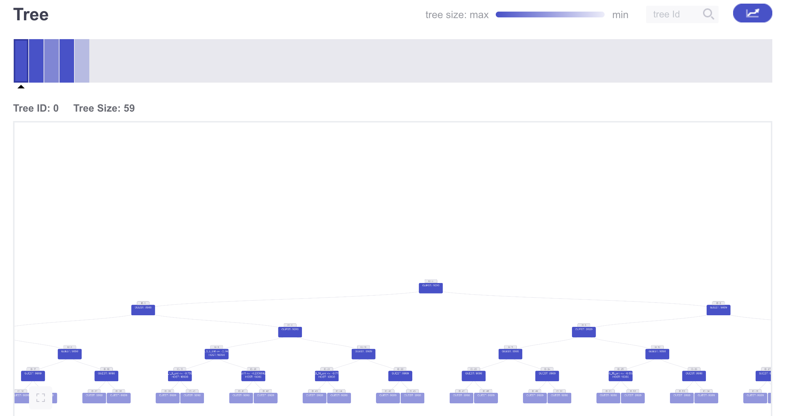

图 23 Fateboard上的树结构

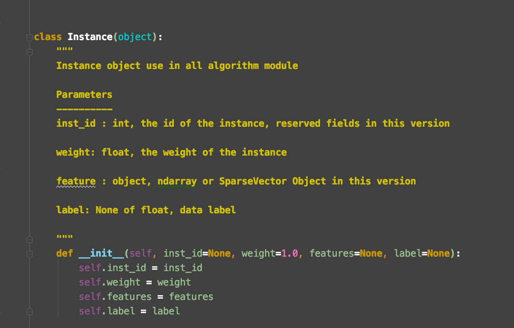

图 24 intance内容图

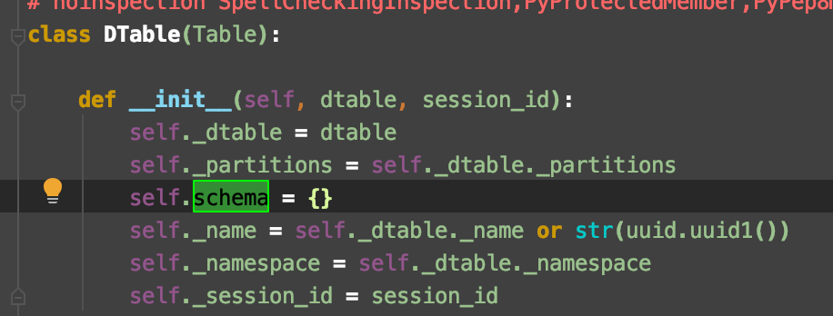

图 25 Dtable信息内容

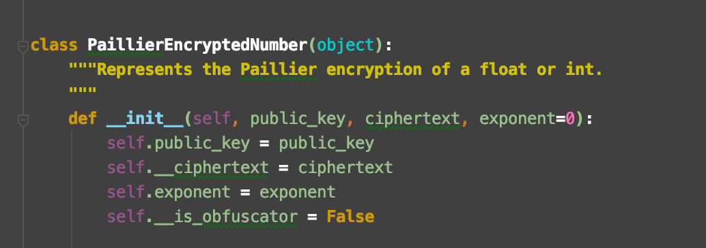
图 26 Paillier 同加密类的属性

