## 联邦建模过程安全性分析
在纵向联邦学习的三方（arbiter，guest，host）架构中，涉及到数据相关的信息交互有五个环节：加密样本ID匹配对齐(RSA)、加密样本ID匹配对齐(RAW)、特征工程-分箱标签加密、纵向模型训练过程、横向模型训练过程。
1.加密样本ID匹配对齐(RSA)环节交互的是加密后的用户粒度的ID信息
【加密算法选择RSA和哈希，加密样本对齐后，guest和host只能得知对齐的样本ID，无法得知非对齐部分的对方样本ID信息】
2.加密样本ID匹配对齐(RAW)环节交互的是加密后的用户粒度的ID信息
【加密算法选择哈希，取交集的一方在过程中自方的ID没有出本地，提高和保障了安全性】
3.特征工程-分箱标签加密环节交互的是模型的样本个数和标签信息
【加密算法选择Paillier同态加密，双方之间不传输原始的业务数据，仅传输加密后的样本个数及标签】
4.纵向模型训练过程
【加密算法选择Paillier同态加密，由arbiter中立方生成秘钥对，将公钥发送给guest和host，私钥在arbiter方。信息交互中，guest和host将用公钥加密后的信息传输给arbiter，arbiter用私钥解密后，将聚合优化后的梯度分别传输给guest和host，guest和host更新模型参数后，继续模型训练。循环以上步骤，直至loss达到预期或者训练次数达到设置的最大值时完成模型训练。在训练的过程中，双方都不知道对方的数据结构，并且只能获得自己那一部分特征需要的参数。所以并没有直接传递数据相关的信息，它们间的通信也是安全的】
5.横向模型训练过程
【加密算法选择Paillier同态加密，双方原始数据信息不进行传输，仅传输模型的参数，arbiter获取不到两方的业务数据信息】
所有交互的信息均在加密情况下进行，解密的私钥在arbiter中立方，arbiter中立方仅获取guest和host双方的模型参数信息，获取不到双方的原始数据，保证信息交互的安全性。

### 加密样本ID匹配对齐（RSA）
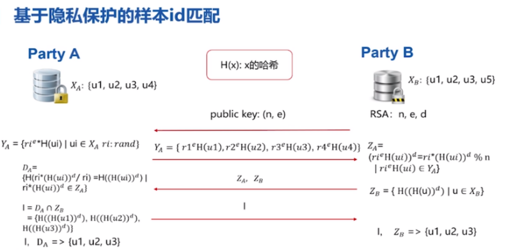
RSA+哈希【A方为GUEST,B方为HOST】：
第一步： B通过 RSA算法产生公私钥，将公钥（n,e）发给 A, A对于每条样本产生一个随机数ri,ri的e次方乘以A方的ID的哈希值【作为第一把锁】
第二步： A 将加密后的结果发给 B
第三步： B方将 A方的结果取d次幂【作为第二把锁】，将B方的ID取哈希值后把 A, B传给 A【之所以需要互传是因为双方需要统一为H(H(u))形式后取交集，相同的ID得到的H(H(u))结果一样】
第四步： A将获得的 A值除以前面产生的随机数ri后进行哈希加密与获得的B值取交集，得到交集的ID再传给B。【其中A并不需要对从B获得的值进行解密，由于A、B两方在传递时ID的顺序没变,所以传递后A、B方会知道特定的位置应该对应哪个ID】
选用哈希的原因：由于ID不一定是纯数字可能是字符串，需通过哈希将其转化为整数.
### 加密样本ID匹配对齐（RAW）
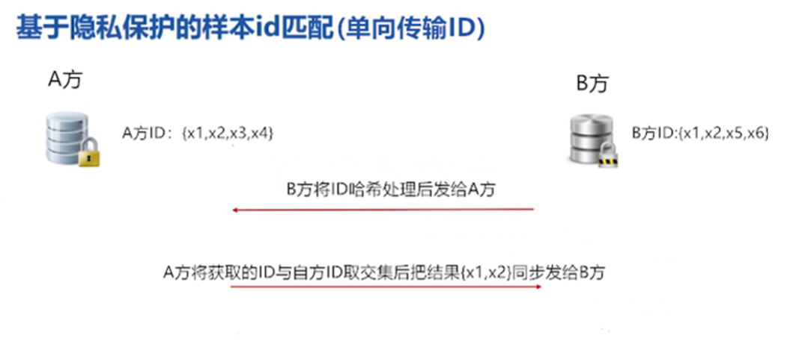
【A.B方可以根据算法参数设置哪方为取交集方和传输方】
A：取交集方(ID不出库)  B:传输方（ID出库）
IDA:{X1、X2、X3、X4}和IDB:{X1、X2、X5、X6} 
A、B方在进行交集前，对自身的 ID 通过哈希算法【MD5,SHA256 等哈希方式】进行加密处理，A方把加密后的ID传给B方，B方为取交集的一方在过程中自方的ID没有出本地，提高和保障了安全性。B方将取交后的结果{X1、X2}同步发给A方。
### 联邦特征分箱标签加密
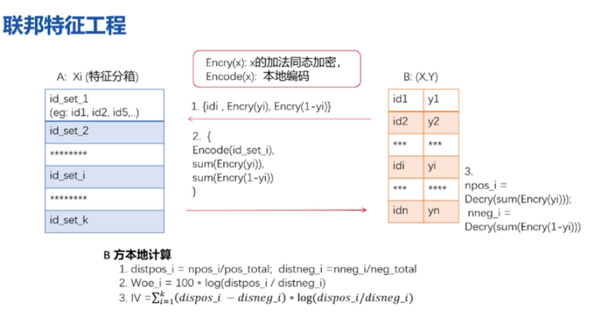
[A方为HOST,B方为GUEST]
特征分箱的目的是计算IV值，IV值是用来衡量这个特征对标签y的贡献程度，辅助于特征选择
在纵向中A侧（含有X）,B侧（含X、Y）计算WOE和IV
由于A侧只有特征X,没有Y,计算WOE和IV得同时依赖X、Y，
A侧不对B侧暴露X，B侧不对A暴露Y,最终只能让B侧获得所有特征的WOE&IV
首先对B侧的标签Y通过同态加密方式加密【Paillier加密具有混淆项，即同样的数字0经过加密后结果不一样，因此不能通过密文推出原来的标签为0还是1】，A侧有自己特征的分箱信息，即知道每个分箱中的ID信息，通过B侧传来的加密标签Y后获得0、1的个数，再将每个分箱中0,1的个数发给B侧，B侧解密后知道0、1个数，进而求得WOE和IV值。
### 纵向模型训练过程梯度传递
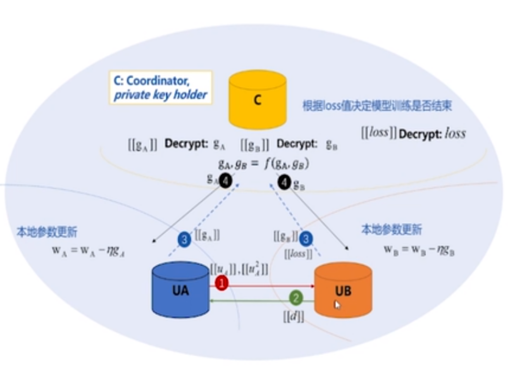
通过线性回归和逻辑回归两种算法进行举例说明：
#### 线性回归
首先假设训练的模型都是简单的线性回归，即 u = Θx，其中Θ为权重矩阵、x 为特征向量、u 为预测结果向量。以 A 为例，它会根据自己的数据计算预测值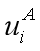，但这个时候只使用了一半的特征，它并不能作为模型的预测结果，它还要加上 B 的计算结果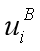才是最终结果。
第一步： A 把中间结果和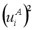加密，并传递给 B。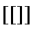表示加密输出。
第二步：现在B获得了，计算残差项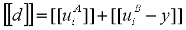，它相当于梯度计算中的系数。例如常规线性回归的损失函数为 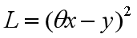，那么 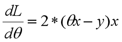，这里经过加密的残差项 [[d]] 就相当于 x 前面的系数。
第三步：借助相互反馈的残差项，A 和 B 能快速算出局部加密梯度，例如 A 的加密梯度为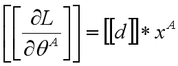。现在A、B两方加密的局部梯度就可以传递到协作者 C 了。
第四步：协作者 C 将解密后的梯度优化后传回A、B方，A、B方也就能使用对应的梯度更新自己那一部分模型。
#### 逻辑回归
总体上，加密训练过程从分发公钥到更新模型一样可以分为四步。
【1,2步包含ID，3.4步不包含】
推导过程中需要用的公式如下：
|  符号   | 含义 |
|  ----  | ----  |
| |加密输出
  | |
| | 
|loss|
|梯度g|
|残差d|
第一步： A 把结果
和加密，并传递给 B。
第二步：现在B获得了和，计算残差项【相当于梯度计算中的系数】和损失loss，其中。把d加密后发给A，把loss加密发给C。
第三步：借助d，A 和 B 能快速算出局部加密梯度 。现在A、B两方把局部梯度加密后传递到协作者 C 。
第四步：协作者 C 将获得的梯度和解密后的梯度优化传回A、B方，A、B方也就能使用对应的梯度更新自己那一部分模型。
【C方优化方式参考FATE源码federatedml\optim\optimizer.py 190-207行】
>在整个模型训练过程中交互的信息主要为模型训练的中间结果信息：梯度（gradient）和损耗（loss）。交互的梯度和loss是模型参数维度的信息。加密算法选择Paillier同态加密。由arbiter中立方生成秘钥对，将公钥发送给guest和host，私钥在arbiter方。信息交互中，guest和host将用公钥加密后的信息传输给arbiter，arbiter用私钥解密后，将聚合优化后的梯度分别传输给guest和host，guest和host更新模型参数后，继续模型训练。循环以上步骤，直至loss达到预期或者训练次数达到设置的最大值时完成模型训练。在训练的过程中，A 和 B 都不知道对方的数据结构，并且只能获得自己那一部分特征需要的参数。所以 A 和 B 之间并没有直接传递数据相关的信息，它们间的通信也是安全的。
### 横向模型训练过程
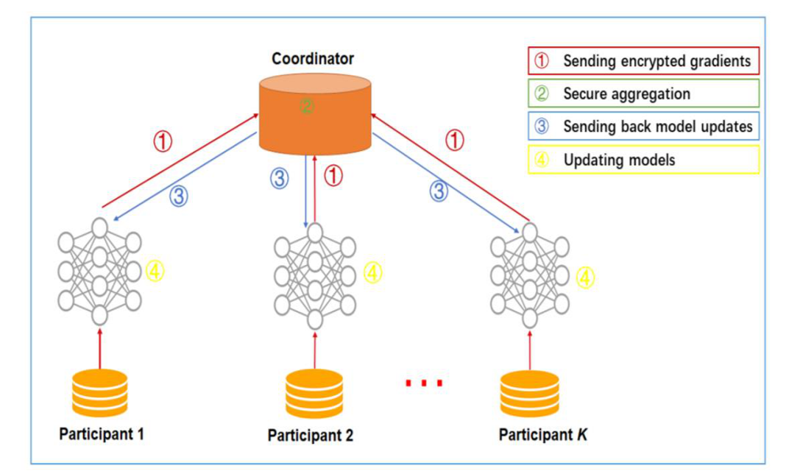
横向训练分为梯度平均和模型平均两种，Fate源码中用的为模型平均
#### 梯度平均：
第一步：各参与方在本地计算模型梯度，对梯度信息进行加密后发送给聚合服务器（arbiter）
第二步：聚合服务器进行安全聚合（secure aggregation）操作，将梯度进行加权平均计算
第三步：聚合服务器将聚合后的结果发给各参与方
第四步：各参与方根据获得的聚合结果进行解密并更新自方模型参数
上述步骤将会持续迭代进行，直到损失函数收敛或者达到允许的迭代次数上限
#### 模型平均：
第一步：各参与方在本地计算模型参数和损失以及己方行数，对信息进行加密后发送给聚合服务器（arbiter）
第二步：聚合服务器进行安全聚合（secure aggregation）操作，将模型参数运用两方行数进行加权平均计算
第三步：聚合服务器将聚合后的模型参数结果发给各参与方
第四步：各参与方根据获得的聚合结果进行解密后更新自方模型参数
上述步骤将会持续迭代进行，直到损失函数收敛或者达到允许的迭代次数上限
