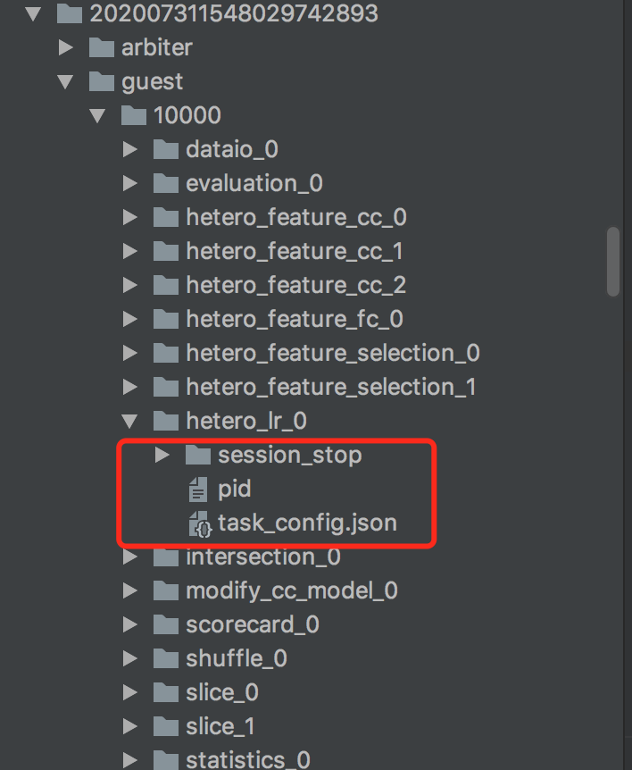
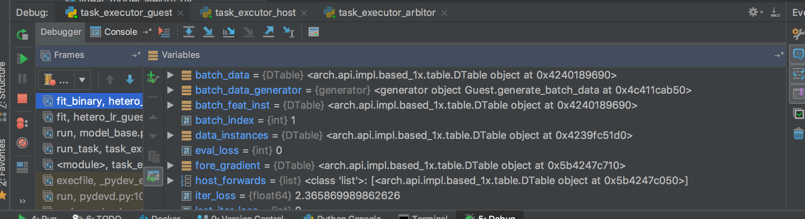
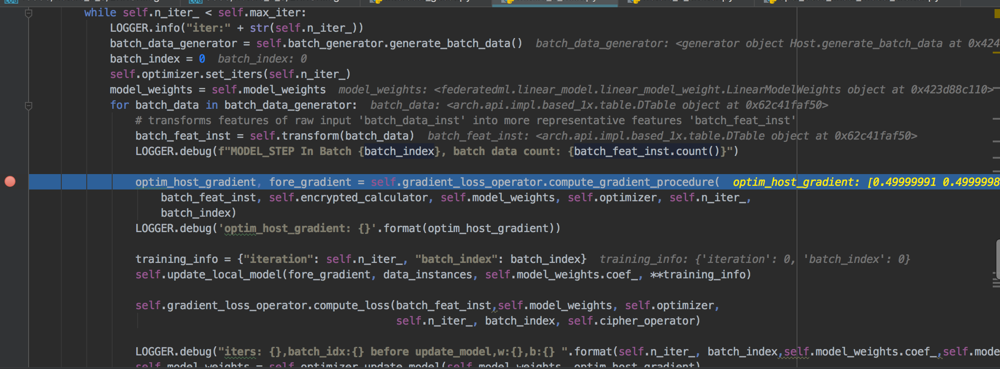
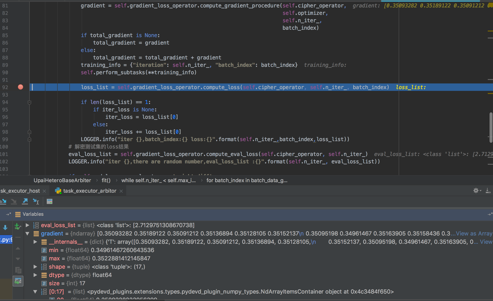
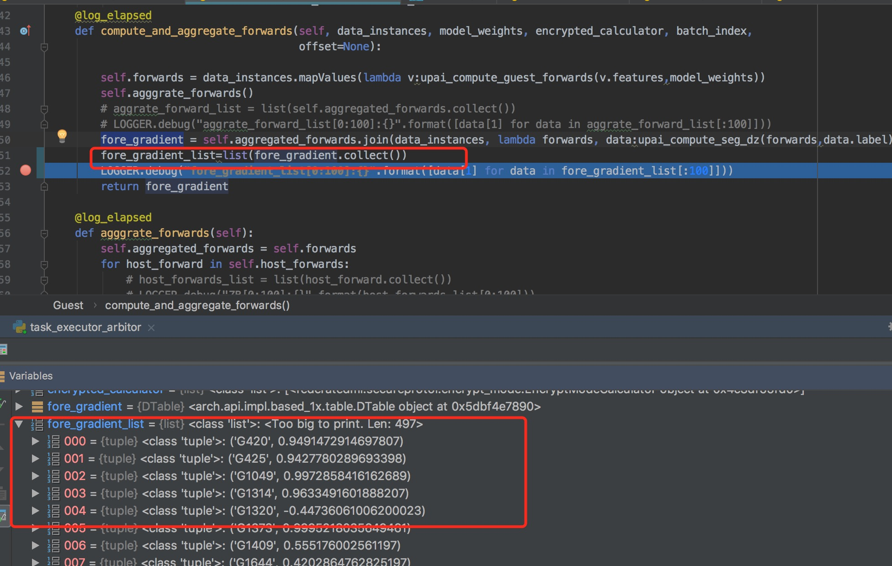

Mac环境下Fate DEV&DEBUG step by step
=================================


### 1 环境配置

-  安装python3  `brew install python3`  python3自带pip3

-  安装系统依赖 `brew install gmp libmpc mpfr hdf5 leveldb`

-  安装python依赖，在fate 根目录执行 `pip3 install -r requirements.txt `

-  安装PyCharm，下载网址：`https://www.jetbrains.com/pycharm/download/`

### 2 简单测试

-  安装PyCharm打开Fate,使用IDE启动fate_flow/fate_flow_server.py 脚本

-  使用IDE运行 examples/federatedml-1.x-examples/quick_run.py 脚本，控制台将输入如下信息

    >/Users/xxx/venv/bin/python /Users/xxx/FATE/examples/federatedml-1.x-examples/quick_run.py
    Upload data config json: {'file': 'examples/data/default_credit_homo_guest.csv', 'head': 1, 'partition': 10, 'work_mode': 0, 'table_name': 'default_credit_homo_guest', 'namespace': 'default_credit_homo_guest_guest'}
    stdout:{
        "data": {
            "board_url": "http://192.168.31.58:8080/index.html#/dashboard?job_id=202001181915023702281&role=local&party_id=0",
            "job_dsl_path": "/Users/xxx/FATE/jobs/202001181915023702281/job_dsl.json",
            "job_runtime_conf_path": "/Users/xxx/FATE/jobs/202001181915023702281/job_runtime_conf.json",
            "logs_directory": "/Users/xxx/FATE/logs/202001181915023702281",
            "namespace": "default_credit_homo_guest_guest",
            "table_name": "default_credit_homo_guest"
        },
        "jobId": "202001181915023702281",
        "retcode": 0,
        "retmsg": "success"
    }
    Upload data config json: {'file': 'examples/data/default_credit_homo_host.csv', 'head': 1, 'partition': 10, 'work_mode': 0, 'table_name': 'default_credit_homo_host', 'namespace': 'default_credit_homo_host_host'}
    stdout:{
        "data": {
            "board_url": "http://192.168.31.58:8080/index.html#/dashboard?job_id=202001181915058443762&role=local&party_id=0",
            "job_dsl_path": "/Users/xxx/FATE/jobs/202001181915058443762/job_dsl.json",
            "job_runtime_conf_path": "/Users/xxx/FATE/jobs/202001181915058443762/job_runtime_conf.json",
            "logs_directory": "/Users/xxx/FATE/logs/202001181915058443762",
            "namespace": "default_credit_homo_host_host",
            "table_name": "default_credit_homo_host"
        },
        "jobId": "202001181915058443762",
        "retcode": 0,
        "retmsg": "success"
    }
    dsl_path: /Users/xxx/FATE/examples/federatedml-1.x-examples/user_config/train_dsl.config_1579346108_9453, conf_path: /Users/xxx/FATE/examples/federatedml-1.x-examples/user_config/train_conf.config_1579346108_7399
    stdout:{
        "data": {
            "board_url": "http://192.168.31.58:8080/index.html#/dashboard?job_id=202001181915093328073&role=guest&party_id=10000",
            "job_dsl_path": "/Users/xxx/FATE/jobs/202001181915093328073/job_dsl.json",
            "job_runtime_conf_path": "/Users/xxx/FATE/jobs/202001181915093328073/job_runtime_conf.json",
            "logs_directory": "/Users/xxx/FATE/logs/202001181915093328073",
            "model_info": {
                "model_id": "arbiter-10000#guest-10000#host-10000#model",
                "model_version": "202001181915093328073"
            }
        },
        "jobId": "202001181915093328073",
        "retcode": 0,
        "retmsg": "success"
    }
    Please check your task in fate-board, url is : http://192.168.31.58:8080/index.html#/dashboard?job_id=202001181915093328073&role=guest&party_id=10000
    The log info is located in /Users/xxx/FATE/examples/federatedml-1.x-examples/../../logs/202001181915093328073
    Task is running, wait time: 10.55770993232727
    Task is running, wait time: 21.68661403656006
    Task is running, wait time: 32.47444009780884
    Task is running, wait time: 43.21940803527832
    Task is running, wait time: 53.8386709690094


### 3 DEBUG 

   由于Fate算法模块启动是多进程方式进行，如果需要单独对某个角色/算法模块调试，则需要找到算法模块进程启动的入口。可以在
   fate_flow/driver/task_scheduler.py 脚本
   > p = job_utils.run_subprocess(config_dir=task_dir, process_cmd=process_cmd, log_dir=task_log_dir)  
   print("run subprocess command:" + " ".join(process_cmd)) ###打印算法进程

   然后运行 examples/federatedml-1.x-examples/quick_run.py 在fate_flow中将会打印算法进程启动的具体参数:
   > run subprocess command:python3 /xxx/python/FATE/fate_flow/driver/task_executor.py -j 2020020822271098076518 -n dataio_0 -t 2020020822271098076518_dataio_0 -r guest -p 10000 -c /xxx/python/FATE/jobs/xxx/guest/10000/dataio_0/task_config.json --job_server 192.168.31.58:9380

   可以看到算法模块是通过fate_flow/driver/task_executor.py脚本文件启动的，那么我们将task_executor.py作为启动脚本，并将后面-j 2020020822271098076518 -n ... 
   的所有参数复制到DEBUG 的Paramaters，就可以进行debug了，具体PyCharm操作为Run->Edit Configuration，如下图
   

   另外，由于PyCharm在启动子进程时会自动加入环境变量等参数，因此还有个地方需要设置，具体操作为PyCharm->Preference：
      
   在Python Debugger中不要勾选Attach to subprocess automatically while debugging
   这个地方如果不去掉勾选，可能在Run某些模块会问题

   在上面完成之后，还不能直接debug会自动结束，因为fate_flow对已经结束的task会生成一个标志文件
   我们需要删除掉task已结束的标志文件，"骗"过fate_flow。
   该文件在jobs/${jobid}/${role}/${component_name}/session_stop,pid文件也可以一并删掉。

   比如我们调试hetero_lr,需要删除如下文件:

   
    
   同样，对与arbiter&host方也需要删除该文件

   设置之后，在debug模式下启动task_executor.py文件，并在具体的算法模块加入断点即可开始debug了， 这里给一个hetero_lr多方运行debug的例子：

   1） 在需要debug地方加入断点，并确保guest&host&arbiter都启动后

   
    
   2） 比如在host进入lr梯度计算前，加入断点：

   

   可以看到程序在这里停了下来

   3) 如果我们想看arbiter在计算所有梯度解密后的结果,

   

   4) 如果我们需要查看具体进行计算的Dtable数据，那么比较慢发，需要先collect()之后，才能查看，如下：

   
     


### 4 Tips

1. 时序问题

   我们debug过程通常在算法跑过一次，上游生成了算法所需数据表之后进行，而在多方计算时，部分算法涉及到密钥对生成和分发
      ，因此一些debug步骤如果时序不对，可能会出现异常；比如求交集过程,host会发送公钥给guest，这时我们需要确保在debug过程中
    guest方   
      	self.transfer_variable.rsa_pubkey.get(-1)
   在host方 
      	self.transfer_variable.rsa_pubkey.remote(public_key,role=consts.GUEST,idx=0) 
    之后运行   

2. Debug过程卡住

   通常还是时序问题，比如guest 传输变量一直在等待接收(get)host方发送(remote)的变量值

3. 日志中LMDB 提示OS Error xxxx No space left，这个在mac环境下经常遇见，不同mac机器都试过会出现这种问题，重启即可解决，另外也可以在上传数据时将partition设置较小值，会减少出现该问题出现概率

4. 性能分析

   在算法开发结束之后，我们通常会困扰与算法性能问题，需要通过对算法部分代码进行优化来提升整体运行效率，因此需要分析算法

   运行时间，在fate中已经提供了一个很好用的装饰器 @log_elapsed ,我们将该装饰器注解在我们关心的地方，在日志中
   
   会自动输出函数运行时间
   
   
   
   在DEBUG.log 和PROFILING.log中我们能看到如下信息：
   
   

   
### update for 1.5.0
需要修改默认的配置文件 conf/service_conf.yaml，将第一行
```
work_mode: 1
```
修改为
```
work_mode: 0
```
否则会报如下错误
```
Traceback (most recent call last):
  File "/Users/yaocz/code/FATE/python/fate_flow/fate_flow_server.py", line 91, in <module>
    init_flow_db()
  File "/Users/yaocz/anaconda3/envs/FATE/lib/python3.7/site-packages/peewee.py", line 393, in inner
    with self:
  File "/Users/yaocz/anaconda3/envs/FATE/lib/python3.7/site-packages/peewee.py", line 2724, in __enter__
    self.db.connect()
  File "/Users/yaocz/anaconda3/envs/FATE/lib/python3.7/site-packages/playhouse/pool.py", line 108, in connect
    return super(PooledDatabase, self).connect(reuse_if_open)
  File "/Users/yaocz/anaconda3/envs/FATE/lib/python3.7/site-packages/peewee.py", line 2820, in connect
    self._initialize_connection(self._state.conn)
  File "/Users/yaocz/anaconda3/envs/FATE/lib/python3.7/site-packages/peewee.py", line 2666, in __exit__
    reraise(new_type, new_type(*exc_args), traceback)
  File "/Users/yaocz/anaconda3/envs/FATE/lib/python3.7/site-packages/peewee.py", line 179, in reraise
    raise value.with_traceback(tb)
  File "/Users/yaocz/anaconda3/envs/FATE/lib/python3.7/site-packages/peewee.py", line 2817, in connect
    self._state.set_connection(self._connect())
  File "/Users/yaocz/anaconda3/envs/FATE/lib/python3.7/site-packages/playhouse/pool.py", line 155, in _connect
    conn = super(PooledDatabase, self)._connect()
  File "/Users/yaocz/anaconda3/envs/FATE/lib/python3.7/site-packages/peewee.py", line 3642, in _connect
    conn = mysql.connect(db=self.database, **self.connect_params)
  File "/Users/yaocz/anaconda3/envs/FATE/lib/python3.7/site-packages/pymysql/__init__.py", line 94, in Connect
    return Connection(*args, **kwargs)
  File "/Users/yaocz/anaconda3/envs/FATE/lib/python3.7/site-packages/pymysql/connections.py", line 325, in __init__
    self.connect()
  File "/Users/yaocz/anaconda3/envs/FATE/lib/python3.7/site-packages/pymysql/connections.py", line 630, in connect
    raise exc
peewee.OperationalError: (2003, "Can't connect to MySQL server on '127.0.0.1' ([Errno 61] Connection refused)")
```


