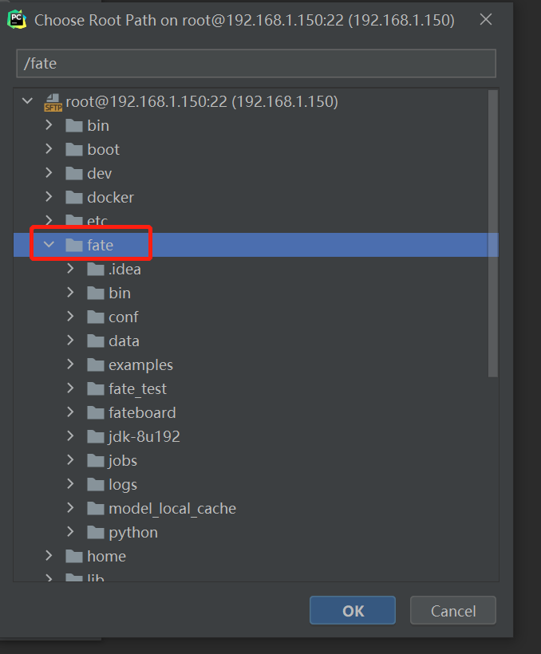
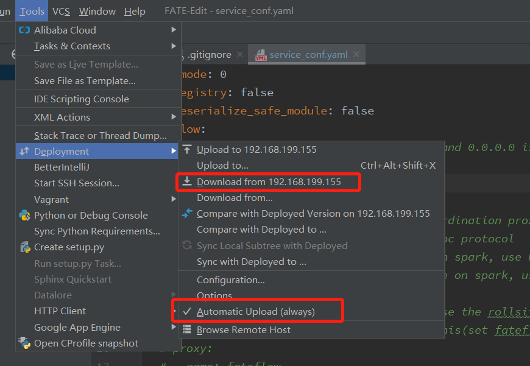

本文参考了文档中的其他教程，算是一个汇总，每一步都写的比较细，使用的fate版本是1.5.1
建议在使用本教程完成本地代码调试配置前，先去官方文档熟悉一下**fate的安装和命令行执行任务训练**的过程

# 暴露端口

远程调试需要使用ssh远程连接fate项目docker容器，所以要进行端口暴露，有两种情况：
## 1.还未安装fate
**在安装脚本中修改docker run，提前设置暴露端口**
​

前提：已经安装python3和pip

未安装可以参考这篇文章：[跳转](https://blog.csdn.net/sunyinggang/article/details/121999586)


下载FATE源码
```
# 设置镜像源
yum-config-manager --add-repo http://mirrors.aliyun.com/docker-ce/linux/centos/docker-ce.repo
# 安装docker
yum install docker-ce-20.10.0 docker-ce-cli-20.10.0 containerd.io
# 开启docker服务
systemctl start docker
# docker开机自启
systemctl enable docker
# 安装docker-compose
pip install -U docker-compose
# 安装FATE，过程比较慢
wget https://webank-ai-1251170195.cos.ap-guangzhou.myqcloud.com/docker_standalone_fate_1.5.1.tar.gz
tar -xzvf docker_standalone_fate_1.5.1.tar.gz
```
容器暴露端口（后续有用）
```
cd docker_standalone_fate_1.5.1
vim install_standalone_docker.sh
```
修改docker run的代码，替换为下面的代码
```
docker run -d --name fate -p 8080:8080 -p 10022:22 -p 9380:9380 fate:latest /bin/bash
```
运行
```
bash install_standalone_docker.sh
```
开启docker容器
```python
docker start fate
```
访问：ip:8080 -> 可以看到页面


一般在运行容器时，我们都会通过参数 -p（使用大写的-P参数则会随机选择宿主机的一个端口进行映射）来指定宿主机和容器端口的映射，例如
```
docker run -it -d --name [container-name] -p 8088:80 [image-name]
```
这里是将容器内的80端口映射到宿主机的8088端口
参数说明

- -d 表示后台运行容器
- -t 为docker分配一个伪终端并绑定到容器的标准输入上
- -i 是让容器的标准输入保持打开状态
- -p 指定映射端口

在运行容器时指定映射端口运行后，如果想要添加新的端口映射，可以使用以下两种方式：
## 2.已安装fate
**将现有的容器打包成镜像，然后在使用新的镜像运行容器时重新指定要映射的端口**
大概过程如下：

先停止现有容器
这里的container-name指代的就是fate

```
docker stop container-name
```
将容器commit成为一个镜像
```
docker commit container-name  new-image-name
```
用新镜像运行容器
```
docker run -it -d --name new-container-name -p p1:p1 -p p2:p2 new-image-name
```
# docker配置远程连接
进入docker容器
注意：如果上边暴露端口使执行的**方法2**，那么这里的fate要替换成new-container-name

```
docker exec -it fate /bin/bash
```
更新容器的apt源，安装**ssh**和**vim**
```
apt update
apt-get -y update
apt-get install --fix-missing openssh-server
apt-get install vim
```
使用vim打开并修改配置文件，找到PermitRootLogin prohibit-password这一行，删除前面的#，修改为PermitRootLogin yes
如果没有就在末尾添加内容：PermitRootLogin yes

```bash
vim /etc/ssh/sshd_config
```
允许通过ssh远程访问docker。
```
# 创建docker中root用户的密码。简单的123456即可
passwd root
# 启动ssh服务，至此，服务器端配置完毕。
service ssh restart
```
# 本地pycharm拉取代码
创建一个新项目，起一个项目名，比如FATE1.5
设置远端服务器

进入到配置界面，点击红框创建服务连接

服务连接如下，端口是10022，用户名密码就是上一步提到的在fate中设置的，可以点击下面test测试是不是能连同，测试成功之后返回

然后下面文件路径选择路径fate,选择ok

然后在Mappings中配置路径，第一个是刚刚创建的项目路径，第二个直接选择根目录

然后这个Tools中Download应该会亮，点击下载代码
Tools->Deployment下的Automatic Upload点击选中，代表本地修改或新建文件时自动上传到远端（ctrl+s保存文件改动）

点击Tools->Deployment->options，勾选红框那里，代表本地删除文件时，远端也自动删除


# 本地连接远程服务器环境
选择settings

project 设置环境，选择Add新添加

设置ip，port是10022，用户名root

填写密码

在1处选择路径：/usr/local/bin/pyhon3

在2处local path就是本地项目路径，远程路径就是/fate （忽略我这里的路径）

配置完成这里显示包名，即代表成功


# 本地开启服务端
先修改配置文件端口
本地修改项目下/conf/service_conf.yaml，这里改为9381，上一行的host修改为0.0.0.0；上传文件（可以配置保存自动上传）

然后去重启docker容器（重启fate），记住每次重启docker容器后都要进入到容器内重启ssh：service ssh restart
然后上面再改回9380，上传文件
然后新打开一个pycharm，open选择项目路径下的python目录


打开文件/python/fate_flow/fate_flow_server.py
点击右键，运行这个文件，下面显示ip:9380即代表运行成功


# 打印任务输出
先修改配置文件端口
本地修改项目下/conf/service_conf.yaml，这里改为9381，上传文件（可以配置保存自动上传）

然后去重启docker容器，记住每次重启docker容器要重启ssh：
```
service ssh restart
```
然后上面再改回9380，上传文件
然后新打开一个pycharm，open选择项目路径下的python目录

在 /python/fate_flow/controller/task_controller.py中process_cmd下打印任务输出->为了查看task执行命令
添加代码：print(" ".join( i for i in process_cmd))

进入到server启动文件，点击右键运行

然后我们使用fate_flow_client.py创建训练任务

将训练任务参数填到这里，run运行fate_flow_client.py
参数就是训练任务的执行命令： -f submit_job -c /fate/examples/dsl/v1/homo_logistic_regression/test_homolr_train_job_conf.json -d /fate/examples/dsl/v1/homo_logistic_regression/test_homolr_train_job_dsl.json

在fate_flow_server.py的输出框中查看输出（如果没有输出多运行几次），


# 开始调试
根据上边打印的信息，我们使用：fate_flow/operation/task_executor.py调试组件，同样根据打印信息，把参数信息放到Parameters中；想调试什么组件看-n后面的参数即可

有一个注意点，因为我们单机版是三方训练，所以正常调试是要有交互的，所以我们不光要设置一个debug；比如这个intersection组件需要guest和host参与，我们要按照他两个的参数信息，创建两个debug任务，上边的打印信息可以看到每个组件的task有几个角色在执行

